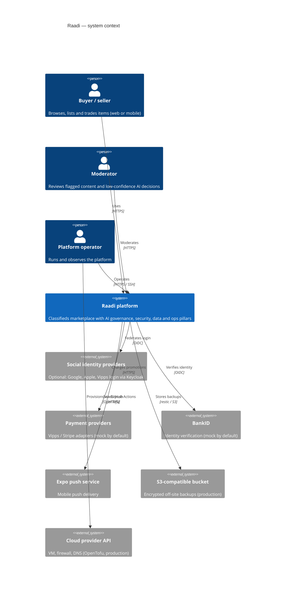
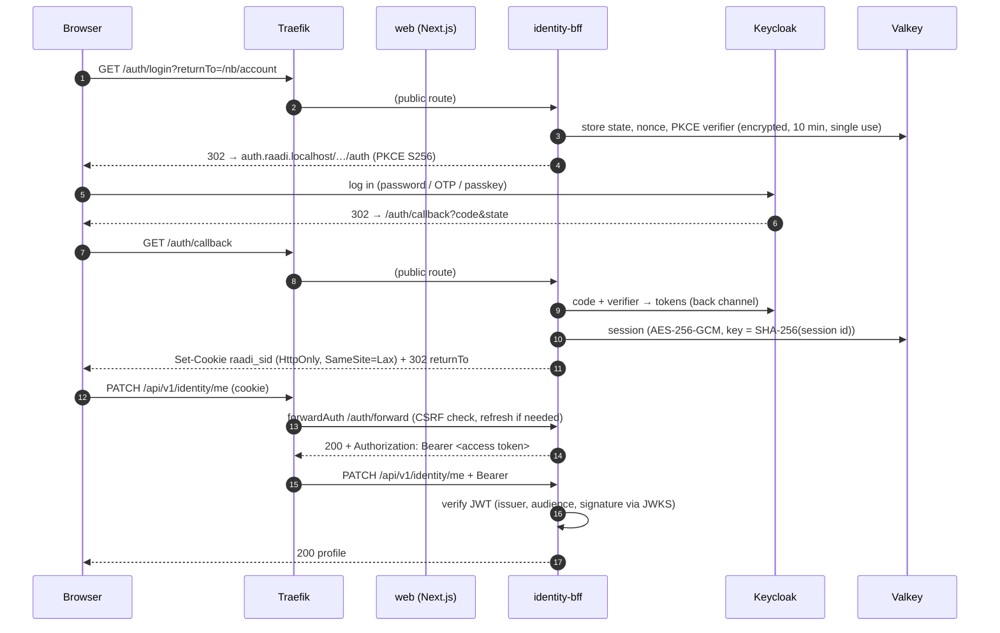
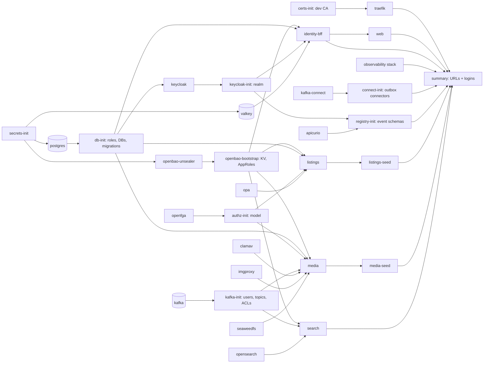

# Architecture (C4)

Raadi is a classifieds marketplace built from independently deployable containers that all run under a single
Docker Compose project, both on a laptop and on a cloud VM. This page covers the **system context** and the
**container** level of the C4 model. Containers marked _(Pn)_ arrive in phase _n_ of the [roadmap](../roadmap.md);
everything else runs today (Phases 1 and 2).

## Level 1 — System context



## Level 2 — Containers

```mermaid
C4Container
  title Raadi — containers
  Person(user, "Buyer / seller")
  Person(ops, "Operator / moderator")
  System_Ext(bankid, "BankID", "OIDC identity verification (bankid-mock realm in Keycloak by default)")
  System_Ext(psp, "Vipps MobilePay / Stripe", "Hosted payment pages and webhooks (payments-mock by default)")

  System_Boundary(edge, "Edge") {
    Container(traefik, "Traefik", "Go", "TLS, routing, rate limits, security headers, forward-auth; CrowdSec bouncer + Coraza WAF (P6)")
  }

  System_Boundary(clients, "Clients") {
    Container(web, "web", "Next.js 16, React 19", "SSR web app, i18n nb/en/so")
    Container(mobile, "mobile", "Expo / React Native", "iOS, Android, web (P3)")
  }

  System_Boundary(domain, "Domain services (NestJS)") {
    Container(bff, "identity-bff", "NestJS", "OIDC login, encrypted sessions, token handler")
    Container(adminbff, "admin-bff", "NestJS (identity-bff image)", "Admin console sessions: own client, cookie, one-time codes")
    Container(audit, "audit", "NestJS", "Append-only audit log of staff actions")
    Container(listings, "listings", "NestJS", "Listings, taxonomy, OPA rules, OpenFGA ownership")
    Container(search, "search", "NestJS", "Event-fed index; full-text, facets, geo (semantic search later)")
    Container(media, "media", "NestJS", "Uploads: ClamAV scan, re-encode, EXIF strip, orphan GC")
    Container(messaging, "messaging", "NestJS", "Buyer-seller conversations; REST to send, WebSocket push")
    Container(notifications, "notifications", "NestJS", "E-mail (queued, throttled) and in-app; Expo push later")
    Container(payments, "payments", "NestJS", "Promoted listings; Vipps/Stripe adapters, signed webhooks")
    Container(paymock, "payments-mock", "NestJS", "Vipps-compatible test PSP (development only)")
    Container(pushmock, "push-mock", "Node", "Expo push-compatible stand-in (development only)")
    Container(saved, "saved", "NestJS", "Favourites and saved searches; alerts as events")
    Container(trust, "trust", "NestJS", "Reviews after a sale, BankID verification (OIDC)")
  }

  System_Boundary(ai, "AI pillars (Python / FastAPI)") {
    Container(gov, "ai-governance", "FastAPI", "OPA policies, audit log, Presidio, GDPR, model registry (P4)")
    Container(sec, "ai-cybersecurity", "FastAPI", "Fraud/scam/ATO detection, SOC assistant (P4)")
    Container(data, "ai-data-management", "FastAPI + Dagster", "CDC lakehouse, quality, enrichment (P4)")
    Container(iacops, "ai-iac-ops", "FastAPI", "Plan review, sizing, drift, backup checks (P4)")
    Container(llm, "LiteLLM + Ollama", "OpenAI-compatible API", "Local LLM + embeddings (P4)")
  }

  System_Boundary(platform, "Platform") {
    Container(keycloak, "Keycloak", "Java", "OIDC, MFA, passkeys, brute-force protection")
    ContainerDb(pg, "PostgreSQL 17", "PostGIS + pgvector", "One database and role per service")
    ContainerDb(valkey, "Valkey", "Key-value", "Sessions, rate limits, cache")
    Container(bao, "OpenBao", "Secrets", "KV v2 + AppRole per service")
    ContainerQueue(kafka, "Kafka (KRaft)", "Apicurio, Debezium", "Domain events from the outbox (CDC)")
    ContainerDb(os, "OpenSearch", "Search", "Full-text, facets, geo (vectors in P4)")
    ContainerDb(s3, "SeaweedFS + imgproxy", "S3", "Images (signed, resized URLs); lakehouse in P4")
    Container(fga, "OpenFGA + OPA", "Authorization", "Relationships (ownership) + marketplace rules")
  }

  System_Boundary(obs, "Observability") {
    Container(otel, "OTel Collector", "OTLP", "Traces, metrics, logs hub")
    ContainerDb(prom, "Prometheus + Alertmanager", "TSDB", "Metrics and alerts")
    ContainerDb(loki, "Loki", "Logs", "Structured logs")
    ContainerDb(tempo, "Tempo", "Traces", "Distributed traces + service graph")
    Container(grafana, "Grafana", "Dashboards", "SSO via Keycloak")
  }

  Rel(user, traefik, "HTTPS")
  Rel(ops, traefik, "HTTPS")
  Rel(traefik, web, "HTTP")
  Rel(traefik, bff, "/auth/*, /api/v1/identity, forwardAuth")
  Rel(traefik, listings, "/api/v1/listings")
  Rel(traefik, search, "/api/v1/search")
  Rel(traefik, media, "/api/v1/media, /img")
  Rel(traefik, messaging, "/api/v1/messaging, WebSocket")
  Rel(messaging, valkey, "Pub/sub fan-out (ACL user)")
  Rel(messaging, listings, "Seller lookup (internal API)")
  Rel(kafka, notifications, "message and listing events")
  Rel(notifications, keycloak, "E-mail address + language (view-users)")
  Rel(traefik, adminbff, "admin.<domain>/auth/*")
  Rel(kafka, audit, "Audit events (from every service's outbox)")
  Rel(kafka, saved, "listing events")
  Rel(saved, search, "Re-runs saved searches (new listings in a time window)")
  Rel(saved, kafka, "Alert events (outbox)")
  Rel(notifications, pushmock, "Pushes (Expo push API; Expo's service in production)")
  Rel(payments, psp, "Create, capture, refund; signed webhooks back", "HTTPS")
  Rel(payments, listings, "Owner and status of the listing (internal API)")
  Rel(kafka, listings, "promotion events")
  Rel(kafka, trust, "listing and message events")
  Rel(trust, bankid, "Verifies identity", "OIDC + PKCE")
  Rel(traefik, keycloak, "auth.<domain>")
  Rel(traefik, grafana, "grafana.<domain>")
  Rel(web, bff, "Session + token exchange")
  Rel(bff, keycloak, "OIDC back channel")
  Rel(bff, valkey, "Sessions")
  Rel(bff, pg, "Profiles + outbox")
  Rel(bff, bao, "AppRole login")
  Rel(listings, pg, "Listings + outbox")
  Rel(listings, fga, "Owner tuples, checks")
  Rel(media, s3, "Store re-encoded images")
  Rel(pg, kafka, "Outbox via Debezium")
  Rel(kafka, search, "listing events")
  Rel(kafka, media, "listing events")
  Rel(search, os, "Index / query")
  Rel(sec, llm, "Classify (P4)")
  Rel(bff, otel, "OTLP")
  Rel(otel, prom, "Metrics")
  Rel(otel, loki, "Logs")
  Rel(otel, tempo, "Traces")
```



## Request flow (Phase 1)



Browsers never see tokens. Mobile apps send their own bearer token, which `forwardAuth` passes through
unchanged. Every service validates the JWT itself (zero trust between services), and the gateway's
`forwardAuth` is never the only check.

## Publishing a listing (Phase 2)

```mermaid
sequenceDiagram
  autonumber
  participant B as Browser
  participant M as media
  participant L as listings
  participant P as PostgreSQL
  participant D as Debezium
  participant K as Kafka
  participant S as search
  B->>M: POST /api/v1/media (image)
  M->>M: ClamAV scan → sniff type → imgproxy re-encode
  M->>P: media row + outbox; OpenFGA owner tuple
  B->>L: POST /api/v1/listings (imageIds)
  L->>L: OPA rules (quota, price, prohibited items); OpenFGA can_attach
  L->>P: listing + listing.published event (one transaction)
  D->>P: read outbox from the WAL
  D->>K: raadi.listing.events (keyed by listing id)
  K->>S: index with external version (idempotent)
  K->>M: mark images attached
```

Search is eventually consistent. A listing becomes searchable once the indexer has processed its event
(`raadi_search_index_lag_seconds`, Marketplace dashboard). Decisions:
[ADR-0012](../adr/0012-event-backbone.md) to [ADR-0015](../adr/0015-search.md).

## Services and ports

Only Traefik publishes ports on the host (80/443, bound to `127.0.0.1` in development). Everything else is
reachable only on the internal Docker network.

| Service                                | Phase                | Internal port                         | Public URL (development)                                           |
| -------------------------------------- | -------------------- | ------------------------------------- | ------------------------------------------------------------------ |
| traefik                                | 1                    | 80, 443, 8082 (metrics)               | `http(s)://*.raadi.localhost`, dashboard `traefik.raadi.localhost` |
| web                                    | 1                    | 3000                                  | `http://raadi.localhost`                                           |
| identity-bff                           | 1                    | 4000                                  | `http://raadi.localhost/auth/*`, `/api/v1/identity/*`              |
| keycloak                               | 1                    | 8080 (HTTP), 9000 (health/metrics)    | `http://auth.raadi.localhost`                                      |
| postgres (PostGIS + pgvector)          | 1                    | 5432                                  | —                                                                  |
| valkey                                 | 1                    | 6379                                  | —                                                                  |
| openbao                                | 1                    | 8200                                  | `http://bao.raadi.localhost` (dev)                                 |
| mailpit                                | 1                    | 1025 (SMTP), 8025 (UI)                | `http://mail.raadi.localhost` (dev)                                |
| otel-collector                         | 1                    | 4317 (gRPC), 4318 (HTTP), 8888, 13133 | —                                                                  |
| prometheus                             | 1                    | 9090                                  | `http://prometheus.raadi.localhost` (dev)                          |
| alertmanager                           | 1                    | 9093                                  | —                                                                  |
| loki                                   | 1                    | 3100                                  | — (via Grafana)                                                    |
| tempo                                  | 1                    | 3200, 4317                            | — (via Grafana)                                                    |
| grafana                                | 1                    | 3000                                  | `http://grafana.raadi.localhost`                                   |
| listings                               | 2                    | 4000                                  | `/api/v1/listings`                                                 |
| search                                 | 2                    | 4000                                  | `/api/v1/search`                                                   |
| media                                  | 2                    | 4000                                  | `/api/v1/media`                                                    |
| kafka / apicurio / debezium            | 2                    | 9092 / 8080 / 8083                    | —                                                                  |
| opensearch                             | 2                    | 9200                                  | —                                                                  |
| seaweedfs (S3) / imgproxy              | 2                    | 8333, 9327 / 8080, 8081 (metrics)     | `/img/…` on the main host (signed)                                 |
| openfga / opa                          | 2                    | 8080, 2112 (metrics) / 8181           | —                                                                  |
| clamav                                 | 2                    | 3310                                  | —                                                                  |
| messaging                              | 3                    | 4000                                  | `/api/v1/messaging/*`, WebSocket `/api/v1/messaging/ws`            |
| notifications                          | 3                    | 4000                                  | `/api/v1/notifications/*`; SMTP out                                |
| payments / payments-mock               | 3                    | 4000 / 4000                           | `/api/v1/payments/*`; `pay.raadi.localhost/pay/` (mock, dev)       |
| saved                                  | 3                    | 4000                                  | `/api/v1/saved/*`                                                  |
| audit                                  | 3                    | 4000                                  | `/api/v1/audit/*` (platform admins)                                |
| admin-bff                              | 3                    | 4000                                  | `admin.raadi.localhost/auth/*`; console at `admin.raadi.localhost` |
| push-mock                              | 3                    | 4000                                  | `push.raadi.localhost/messages` (read-only, dev)                   |
| trust                                  | 3                    | 4000                                  | `/api/v1/trust/*`; BankID OIDC (mock realm in dev)                 |
| mobile (Expo dev server)               | 3                    | 8081                                  | LAN / tunnel                                                       |
| ai-governance                          | 4                    | 8100                                  | `/api/v1/ai/governance`                                            |
| ai-cybersecurity                       | 4                    | 8110                                  | `/api/v1/ai/security`                                              |
| ai-data-management (+ Dagster UI 3070) | 4                    | 8120                                  | `dagster.raadi.localhost`                                          |
| ai-iac-ops                             | 4                    | 8130                                  | `/api/v1/ai/iac`                                                   |
| ollama / litellm / langfuse / mlflow   | 4                    | 11434 / 4000 / 3000 / 5000            | `langfuse.`, `mlflow.` (dev)                                       |
| openmetadata                           | 4 (`--profile full`) | 8585                                  | `catalog.raadi.localhost`                                          |

## Startup order

Compose starts containers in dependency order: `depends_on` with `service_healthy` and
`service_completed_successfully`. Every one-shot init container is idempotent, so all of them run on every `up`:


